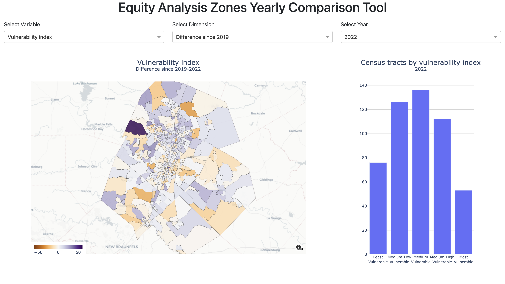

# Equity Analysis Yearly Comparison Tool

Hosted at: [equitytool.austinmobility.io](https://equitytool.austinmobility.io/)

Availability: COA network / VPN



This [dash](https://dash.plotly.com/) app enables users to see the changes to Austin's Equity Analysis Zones (EAZs) over time.

The Census Bureau releases new 5-year estimates on an annual basis and this tool will enable longitudinal analysis of
the EAZs.

## Running the tool

You can either build the docker image yourself, or pull the image from our atddocker dockerhub account.

If you are building your own image, be sure you are in the `maps/` subdirectory

```
docker pull atddocker/dts-equity-analysis-zones-map
```

--or--

```
docker build -t atddocker/dts-equity-analysis-zones-map . --platform linux/amd64
```

Then, run the script inside the docker container.

```
docker run -p 8050:8050 -it --rm atddocker/dts-equity-analysis-zones-map /bin/bash
python eaz_comparison_tool.py
```

Visit http://localhost:8050/ in your browser to view the app.

Alternatively, you can use docker compose. There is a placeholder `README.md` file in `haproxy/ssl/` that needs to be deleted in order for haproxy to run without errors. Then run

```
docker compose up

```

and visit https://localhost:9000/

### Updating or Restarting the App

The tool is deployed in an RDS bastion EC2 instance. The Flask app runs behind the [bastion's HAProxy service](https://github.com/cityofaustin/dts-services-haproxy), which listens on ports 80 and 443 and forwards requests matching the hostname `equitytool.austinmobility.io` to this Docker Compose stack, using these [rules](https://github.com/cityofaustin/dts-services-haproxy/blob/main/haproxy.cfg#L62-L63).

To update or restart the app, follow these steps:

1. SSH into the bastion EC2 instance.
2. Switch to the superuser account:
   ```bash
   sudo -s;
   ```
3. Navigate to the project directory:
   ```bash
   cd /srv/dts-equity-analysis-zones/maps;
   ```
4. If you need to refresh the code or switch branches, pull the latest changes:
   ```bash
   git pull origin;
   ```
5. Restart the Docker Compose stack:
   ```bash
   docker compose down; # stop the stack, discarding state
   docker compose up -d; # bring up the stack in detached mode
   docker compose logs -f; # tail logs, optional
   ```

### SSL/TLS Certificate

The SSL/TLS certificate is sourced via [Let's Encrypt](https://letsencrypt.org/) and is manually renewed every 60 days. [Forthcoming automation is planned](https://github.com/cityofaustin/atd-data-tech/issues/22212), and this marker will be replaced with operating instructions once that is in place.

### Additional Links

The tool is also linked on the [City of Austin SharePoint site](https://cityofaustin.sharepoint.com/sites/tpwEquity/SitePages/Equity-Analysis-Zones.aspx).
